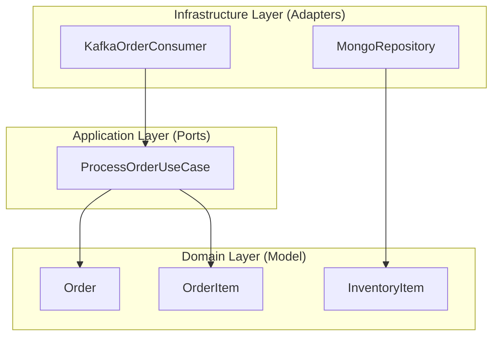

# 📦 Inventarios Service

[](https://spring.io/projects/spring-boot)
[](#architecture)
[](https://kafka.apache.org/)
[](https://www.mongodb.com/)

A robust microservice built with **Spring Boot** and **Hexagonal Architecture** (Ports & Adapters) designed to manage product inventory by consuming order events from Kafka.

---

## 🚀 Key Features

- **Event-Driven Processing**: Consumes order events from the `pedidos` Kafka topic.
- **Structured Deserialization**: Uses `JsonDeserializer` with robust error handling via `ErrorHandlingDeserializer`.
- **Hexagonal Design**: Clear separation between domain logic and infrastructure.
- **Persistence**: Integration with MongoDB for inventory data storage.
- **API Documentation**: Integrated Swagger/OpenAPI UI.

---

## 🏗 Architecture

The project follows the **Hexagonal Architecture** pattern to ensure maintainability and testability:



### Layer Breakdown
- **Domain**: Pure business logic and entities (`Order`, `InventoryItem`).
- **Application**: Use cases and input/output ports.
- **Infrastructure**: Adapters for external systems (Kafka, MongoDB, REST).

---

## 🛠 Technology Stack

- **Java 17**
- **Spring Boot 3.2.4**
- **Spring Kafka**: For reliable messaging asynchrony.
- **Spring Data MongoDB**: For flexible document storage.
- **Lombok**: To reduce boilerplate code.
- **SpringDoc OpenAPI**: For interactive API documentation.

---

## 🔧 Configuration

The service is pre-configured via `src/main/resources/application.yml`:

- **Port**: `8081`
- **Kafka Topic**: `pedidos`
- **Kafka Group ID**: `inventarios-group`
- **MongoDB URI**: `mongodb://localhost:27017/inventarios`

---

## 🚦 Getting Started

### Prerequisites
- JDK 17
- Maven 3.8+
- Local Kafka & MongoDB instances (or Docker)

### Running Locally
1. Clone the repository.
2. Navigate to the `inventarios` directory.
3. Run the application:
   ```bash
   mvn spring-boot:run
   ```

### Documentation
Once running, you can access the Swagger UI at:
[http://localhost:8081/swagger-ui.html](http://localhost:8081/swagger-ui.html)

---

## 📝 Recent Improvements

- **Refactored Kafka Consumer**: Now accepts a structured `Order` object instead of a raw String.
- **Enhanced Error Handling**: Added `ErrorHandlingDeserializer` to prevent consumer blocking on bad records.
- **Type Safety**: Implemented default type mapping for JSON deserialization.


