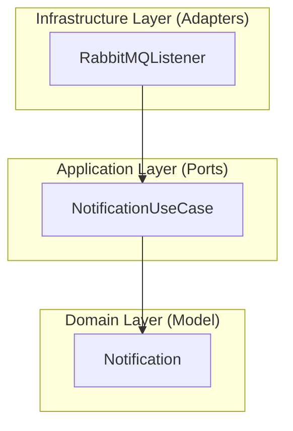

# 🔔 Notificaciones Service

[](https://spring.io/projects/spring-boot)
[](#architecture)
[](https://www.rabbitmq.com/)

A specialized microservice designed to handle real-time notifications by consuming events from **RabbitMQ** (AMQP).

---

## 🚀 Key Features

- **Asynchronous Messaging**: Built on Spring AMQP for efficient message handling.
- **Scalable Notifications**: Designed to push updates via various channels (email, SMS, etc.).
- **Hexagonal Design**: Decouples notification logic from the underlying message broker.
- **Lightweight**: Minimalist implementation focused strictly on notification delivery.

---

## 🏗 Architecture

The service adheres to the **Hexagonal Architecture** guidelines:



---

## 🛠 Technology Stack

- **Java 17**
- **Spring Boot 3.2.4**
- **Spring AMQP**: For RabbitMQ integration.
- **Lombok**: For cleaner domain models.

---

## 🚦 Getting Started

### Prerequisites
- JDK 17
- Maven 3.8+
- Local RabbitMQ instance

### Running Locally
1. Ensure RabbitMQ is running.
2. Run the application:
   ```bash
   mvn spring-boot:run
   ```
