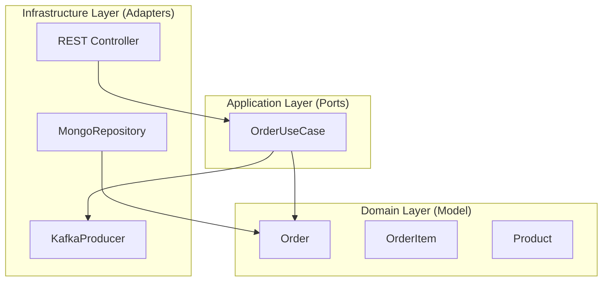

# 🛒 Pedidos Service

[](https://spring.io/projects/spring-boot)
[](#architecture)
[](https://kafka.apache.org/)
[](https://www.mongodb.com/)

The core service of the hexagonal backend project, responsible for managing order creation and publishing events to Kafka.

---

## 🚀 Key Features

- **Order Management**: Create, Read, Update, and Delete (CRUD) operations for orders.
- **Event Producer**: Publishes order events to the `pedidos` Kafka topic upon successful creation.
- **Hexagonal Design**: Implements the Ports & Adapters pattern for high maintainability.
- **Persistence**: Uses MongoDB for reliable order storage.
- **Docker Support**: Includes a `docker-compose.yml` for easy infrastructure setup.

---

## 🏗 Architecture

The project follows the **Hexagonal Architecture** pattern:



---

## 🛠 Technology Stack

- **Java 17**
- **Spring Boot 3.2.4**
- **Spring Kafka**: For publishing order events.
- **Spring Data MongoDB**: For order persistence.
- **Lombok**: To minimize boilerplate code.
- **SpringDoc OpenAPI**: Interactive API documentation (Swagger).

---

## 🔧 Infrastructure

The service includes a `docker-compose.yml` to spin up:
- **MongoDB**: Primary database.
- **Kafka & Zookeeper**: Event streaming platform.

To start infrastructure:
```bash
docker-compose up -d
```

---

## 🚦 Getting Started

### Prerequisites
- JDK 17
- Maven 3.8+
- Docker (optional, for infrastructure)

### Running Locally
1. Start the infrastructure (Kafka & Mongo).
2. Run the application:
   ```bash
   mvn spring-boot:run
   ```

### Documentation
Access the Swagger UI at:
[http://localhost:8080/swagger-ui.html](http://localhost:8080/swagger-ui.html) (Default port is usually 8080, check `application.properties`).

